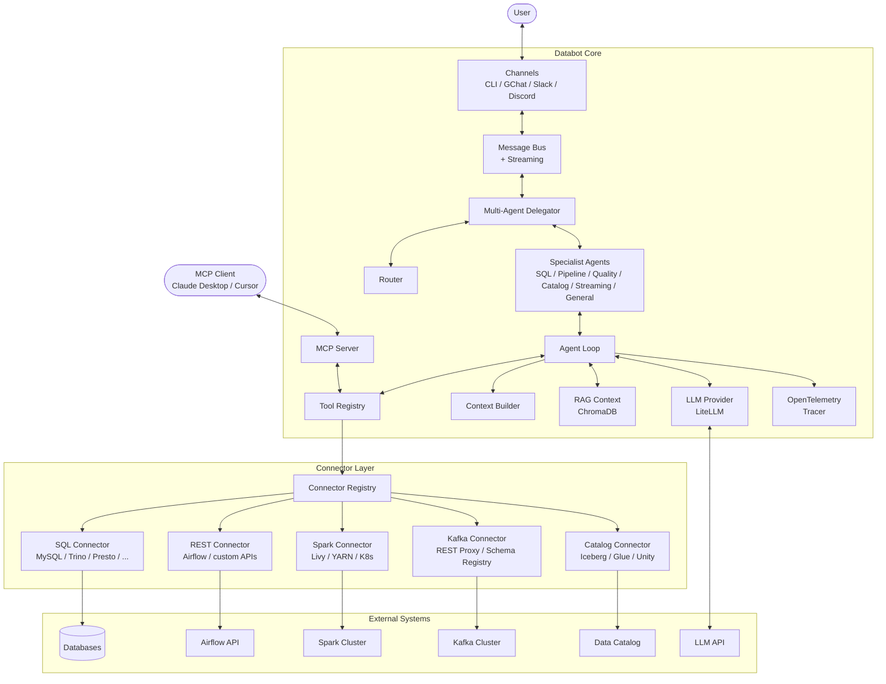
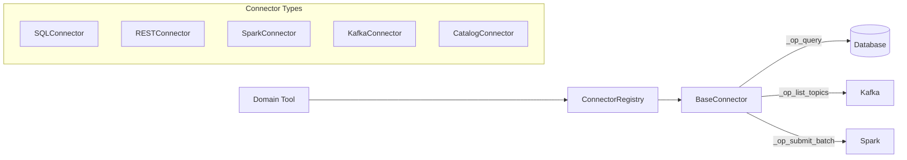

# Databot-AI System Design Document

This document provides a comprehensive overview of the `databot-ai` architecture, designed to help new contributors understand the system's structure, data flow, and key components.

---

## 1. High-Level Design (HLD)

### 1.1 Architectural Overview

`databot-ai` is built as an event-driven, plugin-based agent framework. It decouples the communication channel (e.g., Google Chat, Slack, CLI) from the core logic, allowing the agent to operate agnostically of where messages come from.

The architecture consists of five main layers:

1.  **Input/Output Layer (Channels)**: Handles receiving messages from input sources and sending responses back. Supports CLI, Google Chat, Slack, and Discord.
2.  **Core Layer (Agent Loop + Multi-Agent)**: The brain of the system. Processes messages, manages context, interacts with the LLM, and executes tools. A Router/Delegator pattern optionally dispatches to specialist agents.
3.  **Connector Layer**: Unified abstraction for external data systems — SQL databases, REST APIs, Spark clusters, Kafka, and data catalogs.
4.  **Intelligence Layer (RAG + Observability)**: ChromaDB-backed vector store for context-grounded answers, plus OpenTelemetry tracing.
5.  **Capability Layer (Tools & Plugins)**: Domain tools (SQL, Airflow, Spark, Kafka, Catalog, DQ, Lineage) that delegate to connectors, plus filesystem, shell, and web tools.

### 1.2 System Diagram



### 1.3 Key Components

*   **Message Bus (`databot.core.bus`)**: A central `asyncio.Queue`-based bus that decouples components. Supports both request-response and streaming (`StreamEvent`) patterns. Channels put messages onto the bus, and the core loop consumes them.
*   **Agent Loop (`databot.core.loop`)**: The main execution loop. Supports RAG context enrichment (prepends relevant knowledge from the vector store), streaming token delivery, and tool call retry logic. Configurable iteration limits and token tracking.
*   **Multi-Agent Framework (`databot.agents`)**: Optional Router/Delegator pattern with 6 specialist agents scoped to specific tool subsets. The Router uses LLM-powered intent classification to dispatch user messages to the right specialist.
*   **Connector Registry (`databot.connectors.registry`)**: Central registry managing connector lifecycle — registration, health checks, connect/disconnect orchestration. Loaded from YAML config via the connector factory.
*   **RAG Context (`databot.rag`)**: ChromaDB-backed vector store that ingests schemas, conversations, and documents. `RAGContext.enrich_prompt()` prepends relevant context to user messages before LLM calls.
*   **MCP Server (`databot.mcp`)**: Model Context Protocol server exposing tools and connector resources. Supports stdio transport (Claude Desktop, Cursor) and SSE transport (HTTP clients).
*   **Observability (`databot.observability`)**: OpenTelemetry tracer with graceful fallback to no-ops when OTel is not installed. Traces tool calls and LLM interactions.
*   **Context Builder (`databot.core.context`)**: Constructs the prompt sent to the LLM. Manages system prompt, persistent memory, conversation history, and tool result integration.
*   **Plugin System (`databot.plugins`)**: Dynamically loads `Tools`, `Channels`, and `LLMProviders` using Python entry points, allowing the system to be extended without modifying core code.
*   **Middleware (`databot.middleware`)**: API key authentication and rate limiting for the gateway. Constant-time key verification with configurable sliding-window rate limits.

---

## 2. Low-Level Design (LLD)

### 2.1 Core Data Structures

#### Messages
Communication relies on two primary data classes in `databot.core.bus`:
*   **`InboundMessage`**: Represents a message from a user.
    *   `content`: The text content.
    *   `chat_id`: Unique conversation ID (used for context/session).
    *   `sender_id`: User identifier.
    *   `channel`: Identifier of the source channel.
    *   `stream`: Boolean flag to request streaming response.
*   **`OutboundMessage`**: Represents a response from the bot.
    *   `content`: The text response.
    *   `chat_id`: The conversation it belongs to.
*   **`StreamEvent`**: Token-level streaming event for real-time response delivery.

#### Tools
All tools must inherit from `databot.tools.base.BaseTool`.
*   **`name`**: Unique identifier for the tool.
*   **`description`**: Natural language description for the LLM.
*   **`parameters`**: JSON schema defining the arguments the tool accepts.
*   **`execute(self, **kwargs)`**: The method called when the LLM invokes the tool.

#### Connectors
All connectors inherit from `databot.connectors.base.BaseConnector`.
*   **`name`**: Unique identifier for the connector.
*   **`connector_type`**: Enum — `SQL`, `REST_API`, `PROCESSING`, `STREAMING`, `CATALOG`.
*   **`capabilities()`**: List of operations the connector supports.
*   **`execute(operation, **params)`**: Dispatch to `_op_{operation}` methods.
*   **`connect()` / `disconnect()`**: Lifecycle management.
*   **`health_check()`**: Returns `ConnectorStatus` (HEALTHY, DEGRADED, UNREACHABLE, NOT_CONFIGURED).

### 2.2 Execution Flow

1.  **Ingestion**: 
    *   A `Channel` (e.g., `SlackChannel`, `GChatChannel`) receives an HTTP webhook or event.
    *   It wraps the data in an `InboundMessage`.
    *   It calls `bus.publish(message)`.

2.  **Routing (Multi-Agent)**:
    *   If multi-agent is enabled, the `Delegator` receives the message.
    *   The `Router` uses LLM-powered intent classification to select a specialist agent.
    *   The selected `SpecialistAgent` handles the message using its scoped tool subset.

3.  **Processing (Loop)**:
    *   The `AgentLoop` receives the message (directly or from a specialist).
    *   **RAG Enrichment**: If RAG is enabled, `RAGContext.enrich_prompt()` queries the vector store and prepends relevant context.
    *   **Context Retrieval**: It loads past messages for the given `chat_id` from the session store.
    *   **LLM Inference**: 
        *   `ContextBuilder` formats the messages and system prompt.
        *   `LLMProvider.chat()` (or `chat_stream()` for streaming) is called.
    *   **Decision**:
        *   If the LLM returns text: The loop creates an `OutboundMessage` and publishes it.
        *   If the LLM returns a tool call:
            *   The loop looks up the tool in `ToolRegistry`.
            *   It calls `tool.execute(**arguments)`.
            *   The tool may delegate to a `Connector` via the `ConnectorRegistry`.
            *   The result is added to the context as a "tool" role message.
            *   The loop recurses (calls LLM again with the tool result) to get the final answer.

4.  **Response**:
    *   The `Channel` listens for `OutboundMessage`s on the bus.
    *   For streaming, `StreamEvent`s are sent token-by-token via SSE.

### 2.3 Connector Architecture



*   **Factory Pattern**: `databot.connectors.factory.create_connector()` instantiates connectors from config based on the `type` field.
*   **Operation Dispatch**: `BaseConnector.execute(operation)` routes to `_op_{operation}()` methods, keeping the interface uniform.
*   **Tool Delegation**: Domain tools (SparkTool, KafkaTool, CatalogTool) resolve a connector from the registry and delegate operations. SQLTool and AirflowTool optionally delegate when a matching connector exists, with fallback to legacy direct paths.

### 2.4 Plugin System Detail

Plugins use standard Python `entry_points` defined in `pyproject.toml`.

*   **Discovery**: `databot.plugins.loader` uses `importlib.metadata.entry_points()` to find all packages registered under:
    *   `databot.tools`
    *   `databot.channels`
    *   `databot.providers`
    *   `databot.connectors`
*   **Loading**: The `ToolRegistry.load_plugins()` method iterates these entry points, instantiates the classes, and registers them automatically at startup.

### 2.5 Bootstrap Sequence

The `_build_components(cfg)` function in `databot.cli.commands` orchestrates startup:

1.  Create `MessageBus`, `LLMProvider`, `ToolRegistry`, `SessionManager`, `MemoryManager`
2.  Create `ConnectorRegistry`, load connectors from config, connect all
3.  Register tools (filesystem, shell, web, SQL, Airflow, lineage) — domain tools (Spark, Kafka, Catalog) registered when matching connectors exist
4.  Optionally initialize `RAGContext` (ChromaDB vector store)
5.  Optionally initialize `Tracer` (OpenTelemetry)
6.  Optionally build multi-agent `Delegator` (Router + 6 specialists)
7.  Return 10-tuple: `(bus, provider, tools, sessions, memory, workspace, connector_registry, rag_context, tracer, delegator)`

---

## 3. Directory Structure

```
databot/
├── databot/
│   ├── agents/         # Multi-agent framework (Router, Delegator, Specialists)
│   ├── channels/       # Input/Output adapters (CLI, GChat, Slack, Discord)
│   ├── config/         # Configuration loading (Pydantic models, YAML schema)
│   ├── connectors/     # Connector framework (base, registry, factory, SQL/REST/Spark/Kafka/Catalog)
│   ├── core/           # Main logic (Bus, Loop, Context, Streaming)
│   ├── cron/           # Scheduled task execution
│   ├── mcp/            # Model Context Protocol server
│   ├── memory/         # Persistent key-value memory (SQLite)
│   ├── middleware/     # API key auth, rate limiting
│   ├── observability/  # OpenTelemetry tracing
│   ├── plugins/        # Plugin discovery logic
│   ├── providers/      # LLM API adapters (LiteLLM)
│   ├── rag/            # RAG module (ChromaDB vector store)
│   ├── session/        # Conversation history (SQLite)
│   └── tools/          # Tool implementations (SQL, Airflow, DQ, lineage, spark, kafka, catalog, ...)
├── docs/               # Architecture documentation
├── examples/           # Example plugins and configs
├── k8s/                # Kubernetes deployment manifests
├── tests/              # Pytest suite (188 tests)
└── pyproject.toml      # Dependency and metadata definition
```

## 4. How to Contribute

1.  **Set up Environment**:
    ```bash
    git clone https://github.com/asb108/databot.git
    cd databot
    pip install -e ".[dev]"
    ```

2.  **Add a New Tool**:
    *   Create a file in `databot/tools/`.
    *   Inherit from `BaseTool`.
    *   Implement `parameters` and `execute`.
    *   Register it in `ToolRegistry` (or use a plugin).

3.  **Add a New Connector**:
    *   Create a file in `databot/connectors/`.
    *   Inherit from `BaseConnector` (or `RESTConnector` for REST APIs).
    *   Implement `connector_type`, `capabilities`, `connect`, `health_check`, and `_op_*` methods.
    *   Register the type in `databot/connectors/factory.py`.

4.  **Run Tests**:
    ```bash
    pytest tests/
    ```

5.  **Lint**:
    ```bash
    ruff check databot/
    ```
